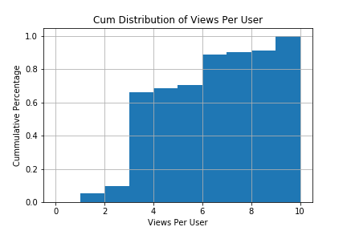
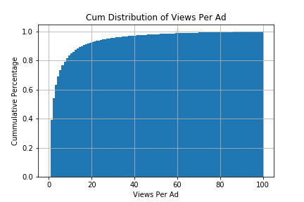
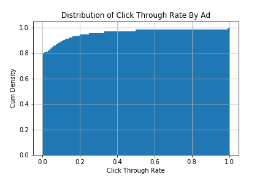

# Click_Through_Rate_Prediction_Taobao
Click Through Rate Prediction using Taobao Dataset

## Objectives
The objective of the project is to create a classification model to predict the click through rate based on the data from the website of Taobao for 8 days of ad impression / click logs.

## Data Source
Ad impression/click logs for 1.1 million users from 2017-05-05 16:00:00 to 2017-05-13 15:59:46, involving 0.8 million ads
User behavior logs dataset for 22 days includes 723 million entries for the behavior of the users covered in the ad impression/click logs. Link to data https://tianchi.aliyun.com/dataset/dataDetail?dataId=56

### Data Schema

Impression/click log
* User ID
* Adgroup ID
* Time: time_stamp of the log
* PID: the position where the ad is presented in the webpage
* Clk: the user clicked the ad or not

Ad features:
* Cate_ID: the ad category id
* Campaign_ID: the ad campaign id
* Customer: the advertiser's id (advertised item supplier)
* Brand: the brand id of the customer
* Price: the price of the advertised item

User features:
* Cms_segid: user micro group id
* Cms_group_id: user cms group id
* Final_gender_code: gender - 1 for male , 2 for female
* Age_level: age_level
* Pvalue_level: Consumption grade - 1: low,  2: mid,  3: high 
* Shopping_level: Shopping depth - 1: shallow user, 2: moderate user, 3: depth user
* Occupation: is the user a college student 1: yes, 0: no
* New_user_class_level: City level based on the population size of the city

Below is the data struction:
# 

## Data Analysis
The EDA is performed based on one day's data, which is from 2017-05-05 16:00:00 to 2017-05-06 15:59:46, which contains 3.3 million impression/click logs, invloving 383,353 users and 366,284 ads.

### Page views per user
The distribution of page views per user shown below is right skewed, with a average page review of 8.5 and a median of 3. 84% of the users have less than 10 page views. In addition, we group the dataset by 'user id' and 'adgroup id', and find 1% of a user-adgroup combination is repeated, which means some users have visited a page for more than one time.
# 

### Views per ad
The distribution of page views per ad shown below is right skewed, with a average page review of 8.9 and a median of 2. 84% of the ads get less than 10 views. In addition, we group the dataset by 'user id' and 'adgroup id', and find 1% of a user-adgroup combination is repeated, which means some users have visited a page for more than one time.
# 

### Click through rate
Click through rate is the ratio of the number of clicks to the number of views an ad got. Below is a snappet of the CTR calculated and the plot of the distribution of the CTR.
#  

### Relationship between features and click
In order to predict the possibility of whether a user will click an ad, we need to select features with predictive power from our dataset. 

From the plot below, we see the distributions of the features 'shopping_level' and 'occupation' for the two groups (click and no-click) are highly overlapped.
# 

### Chi-square test
In addition to the analysis above, we performed chi-square test for the feature selection. Based on the test, we will select features with a p_value less than 0.05, which includes 11 features - 'adgroup_id', 'pid', 'cate_id', 'campaign_id', 'customer', 'brand' 'cms_segid', 'cms_group_id', 'final_gender_code', 'age_level' and 'hour'.
# 

## Reference
* Chi-squared test for nominal (categorical) data http://learntech.uwe.ac.uk/da/Default.aspx?pageid=1440
* https://github.com/moebg/click-through-rate-prediction
* https://medium.com/unstructured/how-feature-engineering-can-help-you-do-well-in-a-kaggle-competition-part-i-9cc9a883514d

