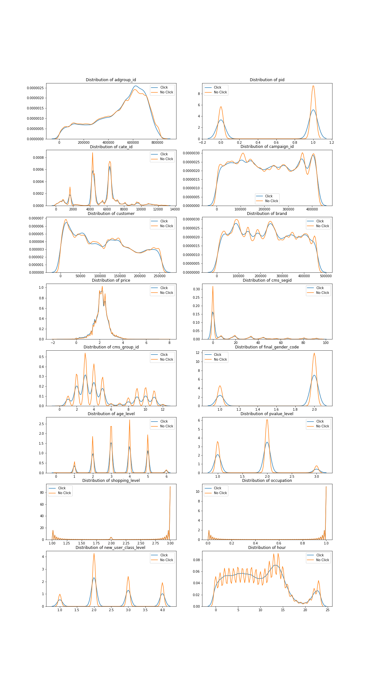

# Click_Through_Rate_Prediction_Taobao
Click Through Rate Prediction using Taobao Dataset 

## Objectives
Online advertising is dominant in marketing in this digital world. Click through rate is the ratio of clicks on a specific ad to the total number of views, which is a very important metric to evaluate ad performance. The objective of the project is to predict the probability of a user to click the displayed ad when the user is visiting a page. 

## Data Source
The data is from the website of Taobao for 8 days of ad impression / click logs. The ad impression/click logs for 1.1 million users is from 2017-05-05 16:00:00 to 2017-05-13 15:59:46, involving 0.8 million ads.
User behavior logs dataset covers all the involved 1.1 million users' behavior history for 22 days, and includes 723 million entries in total. Link to data https://tianchi.aliyun.com/dataset/dataDetail?dataId=56

### Data Schema

Impression/click log
* User ID
* Adgroup ID
* Time: time_stamp of the log
* PID: the position where the ad is presented in the webpage
* Clk: the user clicked the ad or not

Ad features:
* Cate_ID: the ad category id
* Campaign_ID: the ad campaign id
* Customer: the advertiser's id (advertised item supplier)
* Brand: the brand id of the customer
* Price: the price of the advertised item

User features:
* Cms_segid: user micro group id
* Cms_group_id: user cms group id
* Final_gender_code: gender - 1 for male , 2 for female
* Age_level: age_level
* Pvalue_level: Consumption grade - 1: low,  2: mid,  3: high 
* Shopping_level: Shopping depth - 1: shallow user, 2: moderate user, 3: depth user
* Occupation: is the user a college student 1: yes, 0: no
* New_user_class_level: City level based on the population size of the city

Below is the data struction:

  <image src=Visualization/CTRDataStructure.png />

## Data Analysis
The EDA is performed based on one day's data, which is from 2017-05-05 16:00:00 to 2017-05-06 15:59:46. It contains 3.3 million impression/click logs, invloving 383,353 users and 366,284 ads.

### Page views per user
The distribution of page views per user shown below is right skewed. On average, a user has 8.5 page views, while the median of page views is 3. The data indicates 84% of the users have less than 10 page views. In addition, we group the dataset by 'user id' and 'adgroup id', and find 1% of a user-adgroup combination is repeated, which means some users have visited a page for more than one time.

  <image src=Visualization/DistributionOfViewsPerUser.png />

### Views per ad
The distribution of page views per ad shown below is also right skewed, with a average reviews of 8.9 and a median of 2. It shows that 84% of the ads get less than 10 views. 

  <image src=Visualization/DistributionOfViewsPerAd.png />

### Click through rate
Click through rate is the ratio of the number of clicks to the number of views an ad got. Below is a snappet of the CTR calculated and the plot of the distribution of the CTR.

  <image src=Visualization/CTR_Calc.png />

  <image src=Visualization/CTRDensityDistribution.png />

### Relationship between features and click
In order to predict the possibility of whether a user will click an ad, we need to appropriately select features with predictive power from available dataset. We have 16 features in total. They are 'adgroup_id', 'pid', 'cate_id', 'campaign_id', 'customer', 'brand', 'price', 'cms_segid', 'cms_group_id','final_gender_code', 'age_level', 'pvalue_level', 'shopping_level', 'occupation', 'new_user_class_level ', 'hour'. Except for 'price', all features are categorical features.

From the plot below, we see the distributions of the features 'shopping_level' and 'occupation' for the two groups (click and no-click) are highly overlapped and the distribution of other features, to some extent, are showing difference between the two groups.
# 

### Chi-squared test
In addition to the analysis above, we performed chi-square test to asist the feature selection. Chi-squared test is used to determine if there is a difference between the two variables. The null and alternative hypothesis is:
* H_0: A given features is not associated with whether an ad will be clicked.
* H_1: A given feature is associated with whether an ad will be clicked.

The significance level is set to be 0.05. Since we have 15 categorical features, the p_value should be less than 0.003 (0.05/15) to reject the null hypothesis. Based on the test result presented below, we select the following 10 features - 'adgroup_id', 'pid', 'cate_id', 'campaign_id', 'customer', 'brand' 'cms_segid', 'cms_group_id', 'final_gender_code' and 'hour'.

  <image src=Visualization/chi2_test.png />

## Reference
* Chi-squared test for nominal (categorical) data http://learntech.uwe.ac.uk/da/Default.aspx?pageid=1440
* https://github.com/moebg/click-through-rate-prediction
* https://medium.com/unstructured/how-feature-engineering-can-help-you-do-well-in-a-kaggle-competition-part-i-9cc9a883514d

